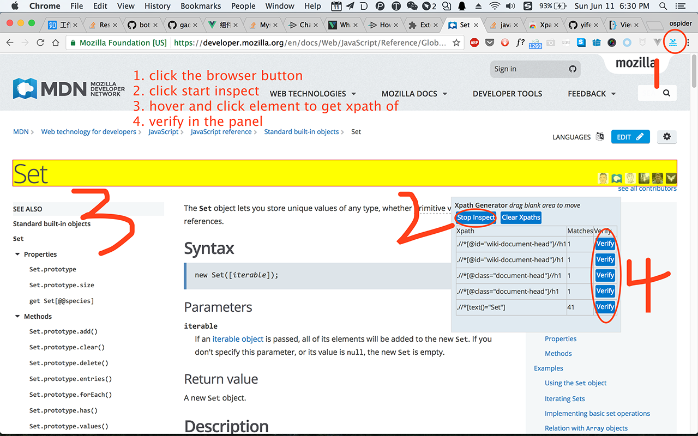

# Xpath Generator

generate xpath expression hassle free.

Xpath Generator generates xpath expression from simply inspecting and clicking
elements in the web page. Then you could choose and verify the generated
expressioins.

## Install

on Chrome Web Store [xpath generator](https://chrome.google.com/webstore/detail/xpath-generator/lpfjogcaifigkimnlkepjlkfhpdhebap)

on Firefox Plugins, comming soon

There is a blog post on [how is xpath generator
implemented](http://hkdev.yifei.me:8000/note/310) in Chinese.

